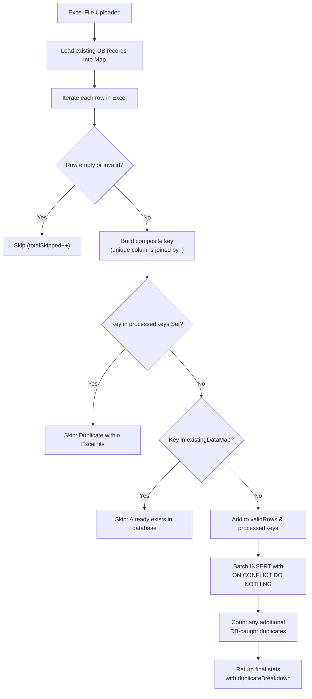

# Fault Codes Uploader — Duplicate Detection Logic

> **Source file:** [FaultUplodes.js](file:///c:/Users/Harshit/Desktop/OBD/Dashboard/dashbordbackend/Dashboard/FaultUplodes.js)

The Fault Codes Uploader uses a **three-layer** duplicate detection strategy to ensure no duplicate records are inserted.

---

## Unique Key Composition

A **composite key** is built by joining the designated unique columns with a `|` delimiter:

```js
const uniqueKey = uniqueColumns.map(col => String(mappedData[col] || '')).join('|');
```

Each table uses a different set of unique columns:

| Table | Unique Columns (Composite Key) |
|---|---|
| `my_fault_codes` | `dtc`, `company_id` |
| `my_fault_code_causes` | `dtc`, `company_id`, `causes` |
| `my_fault_code_symptoms` | `dtc`, `company_id`, `symptom` |
| `my_fault_code_solutions` | `dtc`, `company_id`, `solution` |

---

## Layer 1 — Pre-check Against the Database

**Lines [27–45](file:///c:/Users/Harshit/Desktop/OBD/Dashboard/dashbordbackend/Dashboard/FaultUplodes.js#L27-L45)**

Before processing any Excel rows, the system:

1. Queries the target table for **all existing records** (`SELECT <unique_columns> FROM <table>`).
2. Builds an in-memory `Map` (`existingDataMap`) keyed by the composite key.

```js
const existingQuery = `SELECT ${uniqueColumns.join(', ')} FROM ${tableName}`;
const existingResult = await dbClient.query(existingQuery);

existingResult.rows.forEach(row => {
  const key = uniqueColumns.map(col => String(row[col] || '')).join('|');
  existingDataMap.set(key, true);
});
```

Any incoming row whose key already exists in this map is flagged as **"Already exists in database"** and skipped.

---

## Layer 2 — Intra-File Duplicate Detection

**Lines [48–83](file:///c:/Users/Harshit/Desktop/OBD/Dashboard/dashbordbackend/Dashboard/FaultUplodes.js#L48-L83)**

A `Set` called `processedKeys` tracks every unique key seen **within the current Excel file upload**.

```js
const processedKeys = new Set();

// For each row:
if (processedKeys.has(uniqueKey)) {
  // → Flagged as "Duplicate within Excel file", skipped
} else {
  processedKeys.add(uniqueKey);
  // → Accepted as valid
}
```

If two rows in the same uploaded file share the same composite key, the second occurrence is skipped.

---

## Layer 3 — Database Constraint Safety Net

**Lines [170–202](file:///c:/Users/Harshit/Desktop/OBD/Dashboard/dashbordbackend/Dashboard/FaultUplodes.js#L170-L202)**

Even after the two in-memory checks, the SQL `INSERT` uses `ON CONFLICT DO NOTHING` as a final safety net:

```sql
INSERT INTO <table> (<columns>)
VALUES <values>
ON CONFLICT (<unique_columns>) DO NOTHING
RETURNING id
```

This catches any edge cases or race conditions missed by the earlier checks. Rows rejected by the DB constraint are counted by comparing:

```js
const actualDuplicates = batch.length - actualInserted;
```

> [!NOTE]
> If the batch insert fails entirely (e.g., a SQL error), the system falls back to **row-by-row processing** via [processBatchIndividuallyEnhanced](file:///c:/Users/Harshit/Desktop/OBD/Dashboard/dashbordbackend/Dashboard/FaultUplodes.js#L216-L257), which still uses `ON CONFLICT DO NOTHING` per row.

---

## Response Breakdown

The API response includes a `duplicateBreakdown` object ([lines 148–151](file:///c:/Users/Harshit/Desktop/OBD/Dashboard/dashbordbackend/Dashboard/FaultUplodes.js#L148-L151)):

```json
{
  "duplicateBreakdown": {
    "excelDuplicates": 5,
    "databaseDuplicates": 3
  }
}
```

| Field | Meaning |
|---|---|
| `excelDuplicates` | Duplicates found within the uploaded file + against existing DB data (Layer 1 & 2) |
| `databaseDuplicates` | Additional duplicates caught by the SQL `ON CONFLICT` constraint (Layer 3) |

---

## Flow Diagram


